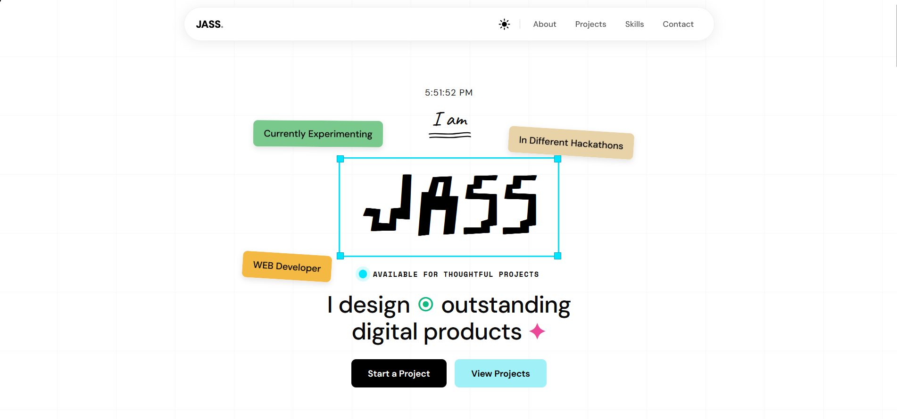

<div align="center">

# Jass Portfolio

A modern, high-performance portfolio website crafted with pure HTML, CSS, and JavaScript — featuring cinematic animations, Apple-inspired UI, and buttery-smooth interactions.

[](LICENSE)
[](https://developer.mozilla.org/en-US/docs/Web/HTML)
[](https://developer.mozilla.org/en-US/docs/Web/CSS)
[](https://developer.mozilla.org/en-US/docs/Web/JavaScript)



</div>

---

## Overview

Jass Portfolio is a zero-dependency, fully hand-coded personal portfolio designed to make a lasting impression. Inspired by Awwwards-winning sites and Apple's design philosophy, it blends precise typography, fluid motion, and refined layout into a seamless experience.

---

## Features

| Feature | Description |
|---|---|
| 🎨 Premium UI/UX | Clean, modern design with strong visual hierarchy |
| ⚡ Smooth Animations | CSS-driven transitions with JS-enhanced interactivity |
| 🧲 Hover Effects | Context-aware micro-interactions throughout |
| 📱 Fully Responsive | Optimized for mobile, tablet, and desktop |
| 🌈 Visual Depth | Gradient meshes, glow effects, and layered transparencies |
| 📩 Contact Form | Functional form with animated success state |

---

## Tech Stack

- **Structure** — HTML5 (semantic markup)
- **Styling** — CSS3 (Flexbox, Grid, custom animations)
- **Logic** — Vanilla JavaScript (no frameworks, no dependencies)

---

## Getting Started

```bash
# Clone the repository
git clone https://github.com/jaskrninlove/Jass.git

# Navigate into the project
cd Jass
```

Open `index.html` in your browser — no build step required.

---

## Project Structure

```
Jass/
├── index.html
├── css/
│   └── style.css
├── js/
│   └── main.js
└── images/
    └── png/
        └── preview.png
```

> Update this tree to reflect your actual folder structure.

---

## Inspiration

Designed with influence from Awwwards-featured studios and Apple's Human Interface Guidelines — prioritizing clarity, motion, and craft at every detail level.

---

## License

Released under the [MIT License](LICENSE). Free to use, fork, and build upon with attribution.

---

## Author

**Jass**

[](https://instagram.com/jaskrninlove)
[](https://t.me/imceobiitxh)

---

<div align="center">

*Built with precision. Designed with intent.*

</div>